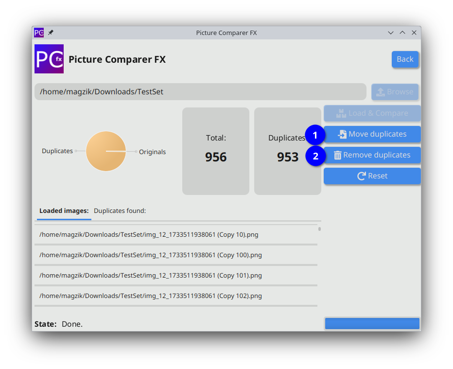

# Picture Comparer FX
#### Version: 1.0

## Introduction:
This application is designed to help you automatically find and manage redundant images in your collection.
Whether you're dealing with duplicate photos or just want a more organized image library,
this tool simplifies the process.

### Key features:
- **Duplicates Removal** - Automatically detects duplicate and deletes duplicate images from your collection.
- **Comparer** - Scans folders to identify duplicate images and allows you to either delete or move them based on your preferences.
- **Image Viewer** - Open and view selected images directly in your system's default viewer.
- **Batch Renaming** - Rename selected images according to a customizable naming pattern.
- **Bulk Deletion** - Permanently delete selected images from you disk with ease.
- **Customizable Duplicate Search** - This application offers flexible options for duplicate detection. Users can:
  - Enable or disable specific search algorithms to tailor the detection process.
  - Activate recursive scanning to search for duplicates across multiple directories and subfolders.

This is my first project developed using a JavaFX Framework and a custom-built image processing library.
Although the app may still have occasional bugs, I am dedicated to improving its performance and enhancing user experience over time.

## Requirements:

### System requirements:

- **Java:** 21
- **Operating System:**
  - Windows 10 (or newer)
  - macOS 11 (Big Sur) (or newer)
  - Linux:
    - Debian/Ubuntu: 20.04 (or newer) (DEB)
    - Fedora/RHEL: version 35 (or newer) (RPM)
    - Arch Linux/Manjaro (Arch)

### Additional requirements (when building from source):

- **Apache Maven** - to compile and build project.
- **Internet access** - to download all dependencies from Maven Central or Jitpack.io.

## Dependencies:

- **Runtime dependencies:**
  - **PictureComparer:** 0.7.0
  - **JavaFX:** 21.0.5
  - **Ikonli:** 12.3.1
  - **SLF4J:** 2.0.13
  - **Logback:** 1.5.15
  - **Jetbrains Annotations:** 26.0.1

## Installation:

### Multi-platform:

To run the application on any system with Java 21+ installed, use the `.jar` file.

#### Requirements: 
- **Java 21** or higher (JDK or JRE).

#### Installation and Launch:
1. Download the latest `PictureComparerFX.jar` from the [Releases](https://github.com/maksik997/PictureComparerFX/releases) section on GitHub.
2. Open a terminal or a file explorer and navigate to the folder containing the `.jar` file.
3. Launch the application: Either using the command below, or double-clicking the file.
```bash
java -jar PictureComparerFX.jar
```

#### Uninstallation:
1. Remove the `.jar` file.
2. Remove the configuration containing directory:

_Windows:_
```bash
C:\Users\[user]\AppData\Roaming\PictureComparerFX
```
_MacOS:_
```bash
~/Library/Application\ Support/PictureComparerFX/
```
_Linux:_
```bash
~/.config/PictureComparerFX/
```

### MacOS:

The application is provided as `.app` file for easy installation and launch.

#### Installation:
1. Download `PictureComparerFX.app` from the [Releases](https://github.com/maksik997/PictureComparerFX/releases) section.
2. Move the file to the **Applications** folder.
3. Double-click to launch the application.
4. If needed, right-click and select **Open** during the first launch to bypass Gatekeeper warnings.

#### Uninstallation:
1. Open the **Application** folder.
2. Locate the `PictureComparerFX.app` file.
3. Right-click and select **Move to Trash**, or drag the application to the Trash.
4. To remove configuration files, open **Finder** and navigate to the following path:
```bash
~/Library/Application\ Support/PictureComparerFX/
```
5. Delete the `PictureComparerFX` folder.

### Linux:

#### Arch Linux / Manjaro (Arch-based)

##### Installation:
1. Download the `PictureComparerFX-Arch.tar.gz` file from the [Releases](https://github.com/maksik997/PictureComparerFX/releases) section.
2. Open a terminal and navigate to the directory with the file.
3. Extract the file:
```bash
tar -xzvf PictureComparerFX-Arch.tar.gz
```
4. Move to the extracted directory:
```bash
cd PictureComparerFX-Arch 
```
5. Run the following command:
```bash
makepkg -si
```
6. After installation, launch the application from the menu or terminal
```bash
picturecomparerfx 
```

##### Uninstallation:
1. Open a terminal.
2. Uninstall the application:
```bash
sudo pacman -Rns picturecomparerfx 
```
3. To remove the configuration files, delete the `PictureComparerFX` folder:
```bash
rm -Rf ~/.config/PictureComparerFX/ 
```

#### Debian / Ubuntu (DEB)

##### Installation:
1. Download the `.deb` package from the [Releases](https://github.com/maksik997/PictureComparerFX/releases) section.
2. Open a terminal and navigate to the directory containing the file.
3. Install the application:
```bash
sudo dpkg -i picturecomparerfx_1.0_amd64.deb
sudo apt --fix-broken install # In case of dependency issues 
```
4. Launch the application:
```bash
picturecomparerfx 
```

##### Uninstallation:
1. Open a terminal.
2. Uninstall the application:
```bash
sudo apt remove picturecomparerfx 
```
3. To remove configuration files, delete the `PictureComparerFX` folder:
```bash
rm -Rf ~/.config/PictureComparerFX/
```

#### Fedora / RHEL (RPM)

##### Installation:
1. Download the `.rpm` package from the [Releases](https://github.com/maksik997/PictureComparerFX/releases) section.
2. Open a terminal and navigate to the directory containing the file.
3. Install the application:
```bash
sudo dnf install picturecomparerfx-1.0-1.x86_64.rpm
```
4. Launch the application:
```bash
picturecomparerfx 
```

##### Uninstallation:
1. Open a terminal.
2. Uninstall the application:
```bash
sudo dnf remove picturecomparerfx
```
3. To remove the configuration files, delete the `PictureComparerFX` folder:
```bash
rm -Rf ~/.config/PictureComparerFX/ 
```

### Building from source:

1. Clone git repository:
```bash
git clone https://github.com/maksik997/PictureComparerFX.git
cd PictureComparerFX
```
2. Build project using Maven:
```bash
mvn clean package
```
3. Launch the app using: `PictureComparerFX-[VERSION]-SHADED.jar` file.

## Usage:

### Main menu:

The main menu provides you with several choices

1. Enter the `Comparer` module.
2. Enter the `Gallery` module.
3. Enter the `Settings` module.
4. Enter the `Credits` module.
5. Exit the app.


### Comparer:

Use the `Comparer` module to find and manage duplicate images within a selected directory.

1. Pick a directory by clicking the `Browse` button.


2. Start the processing by clicking `Load & Compare` button.


3. Wait until the process finishes.


4. Use `Remove duplicates` button to delete duplicates, or `Move duplicates` button to relocate them.



5. Reset by clicking `Reset` button.


### Gallery:

The `Gallery` module lets you manage your image collection.

1. Add images to the gallery.


2. Remove images from the gallery.


3. Delete images from disk.


4. Remove duplicate images from disk.


5. Rename images using patterns.


6. Open images in your system's default viewer.


### Settings:

The `Settings` module provide you with several customization options:

1. Adjust language and theme.


2. Set destination paths for duplicate images, and enable recursive scanning and algorithms.


3. Configure renaming options.


4. Remember to save your settings.

## Contribution:

We welcome contributions! If you'd like to contribute, 
please fork the repository, create a new branch, 
and submit a pull request with your changes.

## License:

This project is licensed under the MIT License. See the `LICENSE.txt` file for details.
